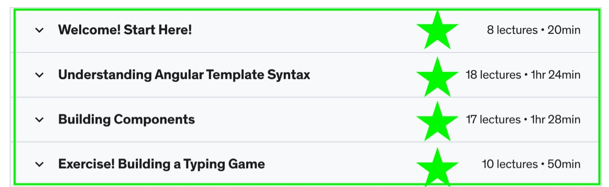
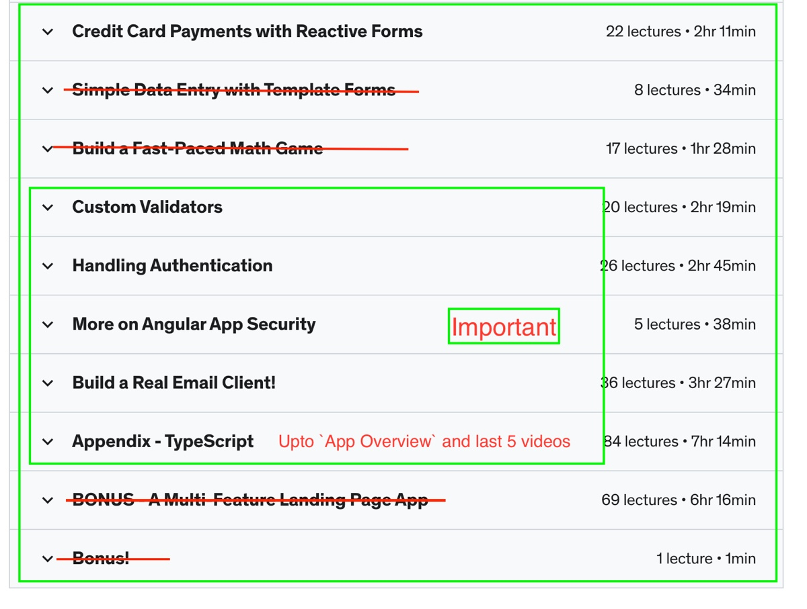

# Basic Courses

This course is for the Interns, which are new to the `cs-ui-app project`

This course is for the Interns, which are new to the `cs-ui-app project` and starting to contribute to the project. These courses will provide you with the foundation you need to get involved. With Advanced CSS/SCSS to Angular and Spring Boot.

:::tip[Info]
The cyberspark-training Slack section contains a link to the shared credentials. Please refer to it for access.
:::

  
<b> Front End Courses</b> 

  

    

      💡By these courses, you will get a complete understanding of CSS/SCSS and
      Angular. After this you'll be able to start contributing to the
      project.{" "}
    

     
    

      

        <b>Basic css/scss Bootcamp</b>
      

      

        <strong>
          Reinforce your CSS concepts with Course: Advanced CSS and Sass
          Flexbox, Grid, Animations and More!{" "}
        </strong>
      

      

        <Scss />
      

    

     
    

      

        <b>The Modern Angular Bootcamp</b>
      

      

        <strong>
          Get ready with Angular! Understand how to build and deploy
          production-ready apps.{" "}
        </strong>
      

      

      
        <AngularCourse />
        
 
        
**Relevant Topics to cover**

        
        
        
        
        
        
        

      

    

  

  
<b>Angular Crash Course</b>

  

    

      Taking this optional course is an excellent way to elevate your Angular knowledge
    

      

        <AngularCrashCourse />
      

     
  

export const AngularCourse = () => (

  

    <a
      style={{
        textAlign: "center",
        alignItems: "center",
        textDecoration: "none",
        margin: "310px",
        paddingTop: "45px",
      }}
      href="https://www.udemy.com/course/the-modern-angular-bootcamp/"
    >
      <button style={{ padding: "10px" }}>The Udemy Course Link</button>
    </a>
  

);

export const Scss = () => (

  

    <iframe
      width="800"
      height="450"
      src="https://www.youtube.com/embed/nu5mdN2JIwM?si=_Gs7WkEDhuMByaCo/"
      frameborder="0"
      allowfullscreen
    ></iframe>
    <a
      style={{
        textAlign: "left",
        alignItems: "left",
        textDecoration: "none",
        marginLeft: "-15px",
        padding: "15px",
      }}
      href="https://www.youtube.com/embed/nu5mdN2JIwM?si=_Gs7WkEDhuMByaCo/"
    >
      <button style={{ padding: "10px" }}>The Course Link</button>
    </a>
  

);
export const AngularCrashCourse = () => (

  

    <iframe
      marginTop = "25px"
      width="800"
      height="450"
      src="https://www.youtube.com/embed/WHv1YQUg6ow?si=GWUiIV6RWWx-Xr9H/"
      frameborder="0"
      allowfullscreen
    ></iframe>
    <a
      style={{
        textAlign: "left",
        alignItems: "left",
        textDecoration: "none",
        marginLeft: "-15px",
        padding: "15px",
      }}
      href="https://www.youtube.com/embed/WHv1YQUg6ow?si=GWUiIV6RWWx-Xr9H/"
    >
      <button style={{ padding: "10px" }}>The Course Link</button>
    </a>
  

);
