# 03. Guidelines for Contribution

<section style={{textAlign: 'justify'}}>

:::warning 💡Reminder
**All necessary contribution information is available within VGame.**
:::

<div>
<YoutubeEmbed />
</div>

<aside>
💡 The attached image highlights your assigned tasks and those of other VGame team members. To access the detailed information:
In this Documentation we’ll be working on the ticket CSUI-1700

</aside>

1. **Open the VGame.**
2. **Copy and paste the link into the browser on the Citrix shared desktop.**
3. **Once pasted, you'll gain access to the details and to other additional required information.**

<!--  -->

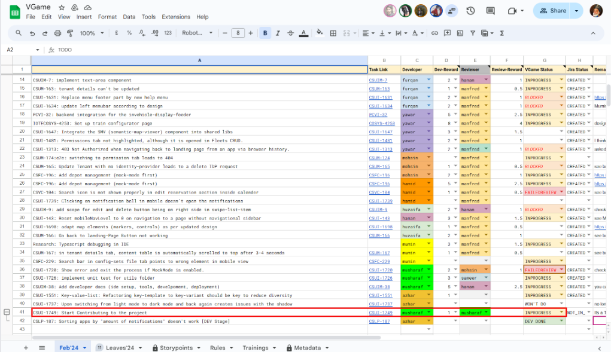

:::info 💡INFO
Only In the Citrix Jira, you will be able to access the task link and then you could easily go through the required description, screen shots, developers assigned and other related information for you task.
:::

<!--  -->

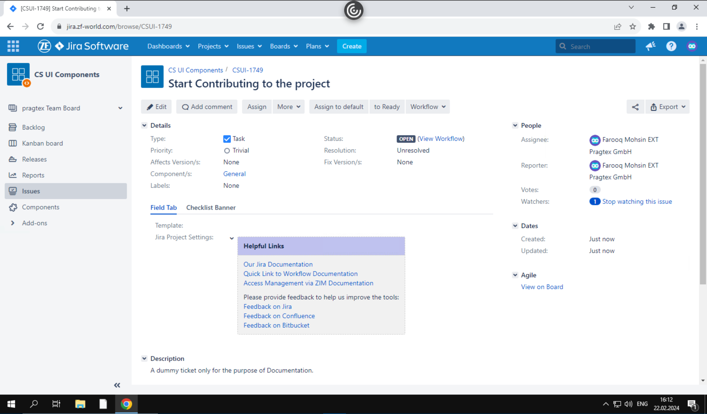

**_Reference Image 1.0_**

## **Let's delve into a practical example to solidify your understanding for contributions.**

1.  **Branch Identification:**
    - As clarified in previous documentation, tickets with the `<CSUI>` prefix require using the `master` branch as the working branch.
2.  **Using CLI**:

    - **IntelliJ:** Open your project in IntelliJ and **checkout** to the master branch using:
      `git checkout master` .

    ```bash
    git checkout master
    ```

    <!--  -->

    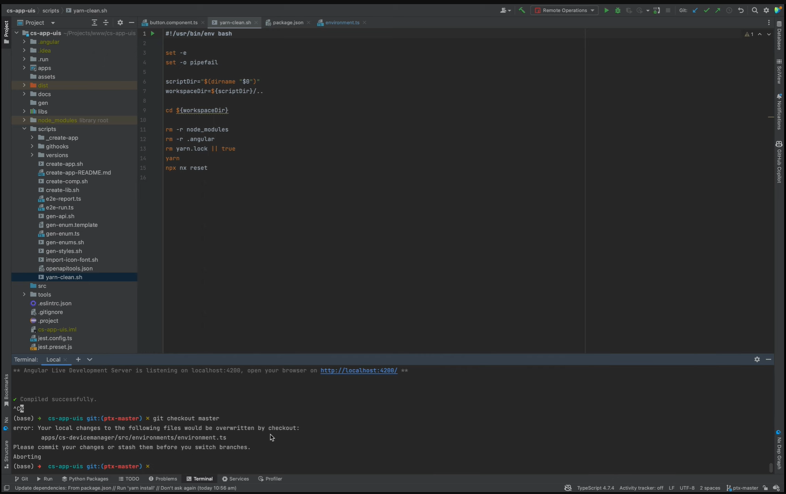

3.  After getting into the master branch, pull the latest changes. This is a crucial step to make the repository updated, and lets you to contribute without any merge conflicts or errors. Type in the following command:

    ```bash
    git pull
    ```

4.  Now since we aren’t allowed to make changes in the main branch directly, we need to create a sub-branch from the master branch.

:::info ✨INFO
For **_CSUI_** related tickets, we need to create a sub-branch from **_master branch_** and for any **_application related tickets_** we need to create a sub-branch from the **_ptx-master branch._**
:::

5.  Now, to create a new branch from the target branch we follow the name convention as: **_`<TICKET NO>_PTX<TASK TYPE>_DESCRIPTION`_**
6.  Taking the example from the above referred **_Image 1.0_**, if we need to contribute to this ticket we just need to follow the given commands.

    ```bash
    git checkout -b CSUI-1749_ptx_feat_start-contributing-to-the-project
    ```

    ### Here, we have some important points to remember:

    - **_`git checkout -b`_** is used to create a new sub-branch from the master branch.
    - `CSUI-1749` represents the ticket number assigned to you.
    - **_`Task Type`_** can be either **_`FIX/FEAT/CHORE/REFACTOR`_** depending on the type of work you are doing, where:

    - **_FIX_**: Patches a bug in the codebase. A bug fix for the user, not a fix to a build script.

    - **_FEAT_**: Adding a new feature to the codebase.

    - **_CHORE_**: Changes that are not related to a fix or feature. These changes do not modify src or test files. Examples include updating dependencies, no production code change.

    - **_REFACTOR_**: A code change that does not add a feature or fix a bug. Simply Refactoring production code, eg. renaming a variable etc.

    - **_`start-contributing-to-the-project`_** represents the description of the ticket. (This is visually written in **_slug type_**. You can either write it in this way or simply generate a slug description using **_slugify.online_**)
        <!--  -->
      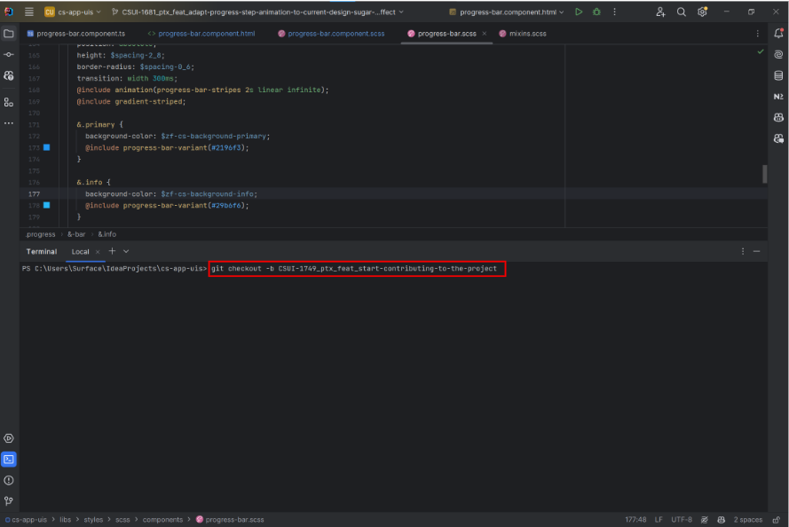
      **_Reference Image 1.01 (This Image represents the creation of a new branch)_**

7.  After you are done contributing to the task, you need to commit the done changes to the **_GitLab_** repository.

    1. When you are ready to commit your contributions, double click the **_Shift key_**, a window will appear, and then search for commit. **_Refer the below Image_**

    <!--  -->

    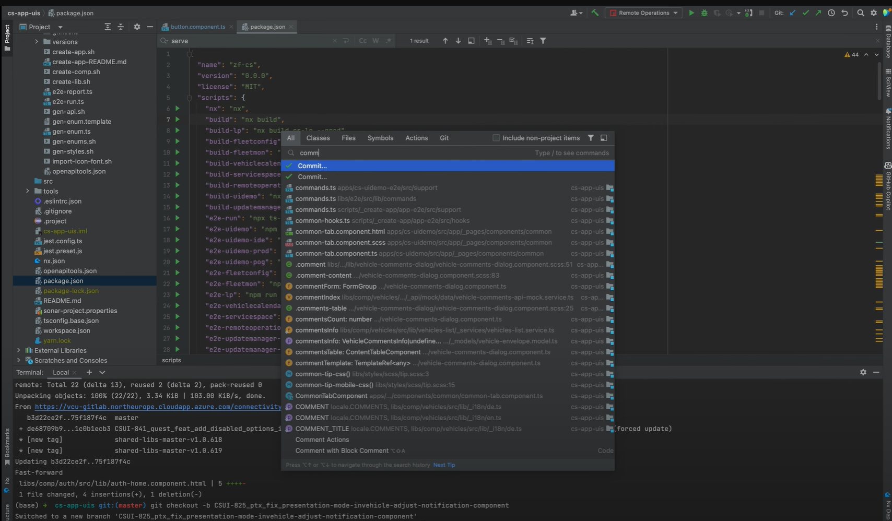

8.  Once you click the first option, you will see the following window. In this window you need to write a brief description of the commit you have done. **_Refer the below Image_**
    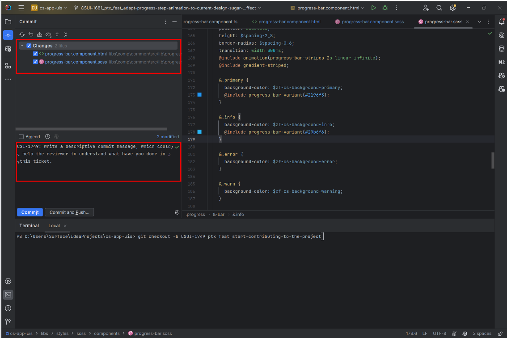

9.  Once you are done with the commit message, you need to click the **_commit and push_** the changes/contributions to the **_GitLab repository_**. **_Refer the below given Image._**

    <!--  -->

    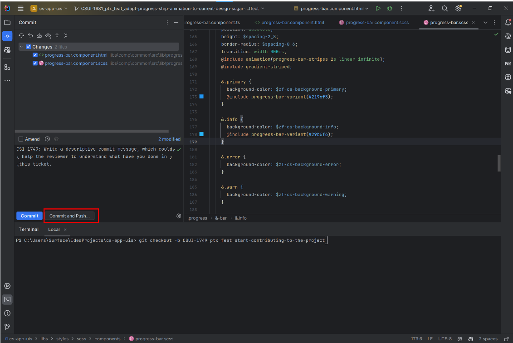

10. After this step, you will get a new dialouge box, at this stage you need to click push, and all your changes will be pushed to the GitLab repository.

    <!--  -->

    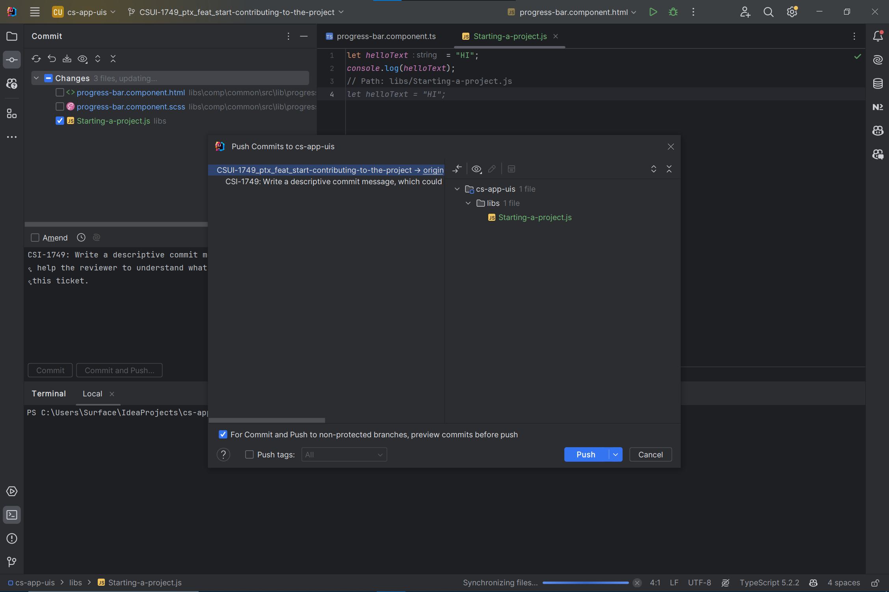

11. Once you are done committing and pushing the changes to the **_GitLab_** repository, you now need to go on your **_GitLab, and y_**ou will get a message to **_CREATE MERGE REQUEST. Click the button and proceed forward. Refer the Image below._**

    <!--  -->

    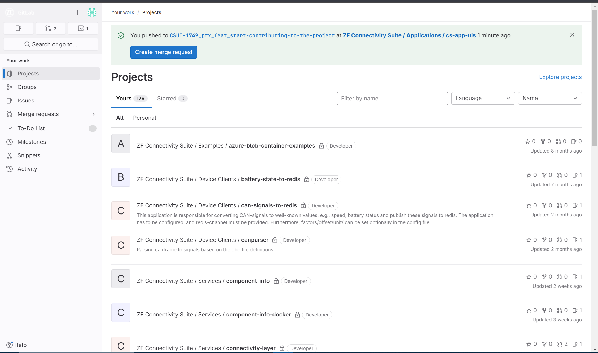

12. At this step, you need to select the assignee and the reviewer and then click the **_Create Merge Request._**

    <!--  -->

    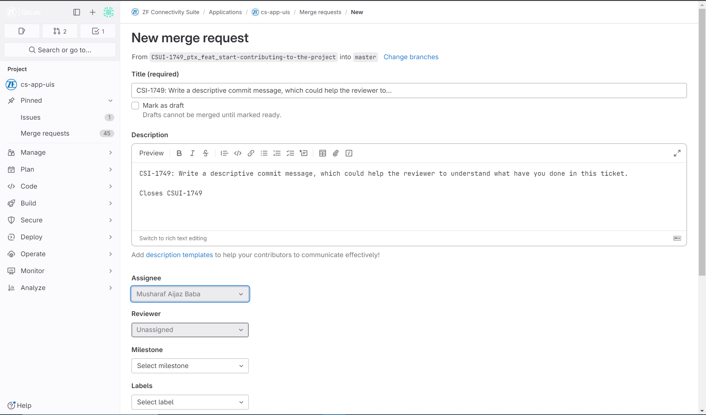

    <!--  -->

    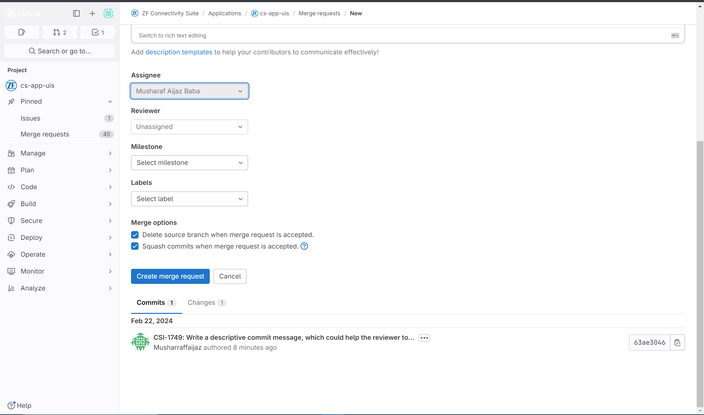

13. After creating an MR Request, you need to copy this **_GitLab link_** and then share it in the slack **_shared-components-topics. It’s very Important to announce and share this information with other fellow developers so that they are updated and also the reviewers can also review and merge your request._**
14. Once you are done with your contribution and you have created an MR, you also need to mark **_DEV DONE_** in the **_VGame, only for the Jira Status_**.
    <!--  -->
    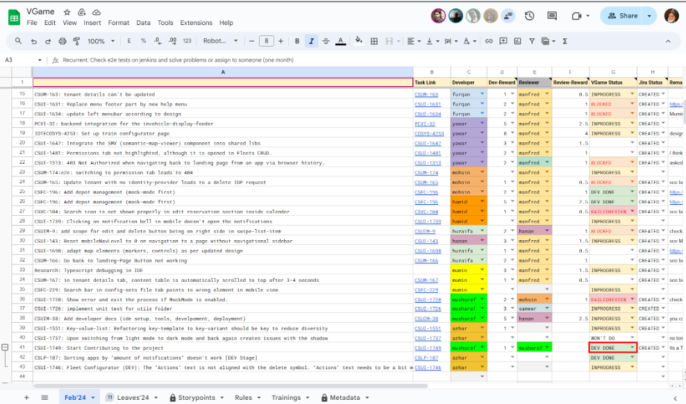

</section>

export const YoutubeEmbed = () => (

  <div style={{width: '100%', height:'100%'}}>
<iframe width="870" height="400" src="https://www.youtube.com/embed/6KunHvD_WbM?si=ZhWH7EtD9sAxrcdI" title="YouTube video player" frameborder="0" allow="accelerometer; autoplay; clipboard-write; encrypted-media; gyroscope; picture-in-picture; web-share" allowfullscreen></iframe>
  </div>
);
