# 04. How To Do A Release Of CS-APPS

**Releasing a Version of CS-APPS: A Guide with Code Snippets**

:::info Tip
✨ **Note:** This guide uses **CSLP 1.4.0** as a reference. Adjust accordingly for other versions.
:::

## **Understanding SNAPSHOT Versions:**

:::info TIP
💡 Maven's "**SNAPSHOT**" \*\*refers to an in-progress version of a software project, indicating ongoing development and not yet released
:::

## **Preparing for Release (Pre-Release):**

1. **Create a JIRA Ticket:**
   Before Releasing of the new version of any build, create a JIRA ticket named: <br/> <span style={{backgroundColor: '#193C47', padding: '2px'}}>**_CS < component >-< ticketnumber >< versionNumber >: Release_**. Example, **_CSLP-1551: Key-value-list: Refactoring key-template to key-variant should be key to reduce diversity_**.</span>

## Front-End Release (apps-frontend)

1. **Clone the app through the GitLab:** Check out the frontend repository of the application, in case you don't have it, clone it from **_GitLab,_** and create a pull. **_Refer (1.0 for details)_**
   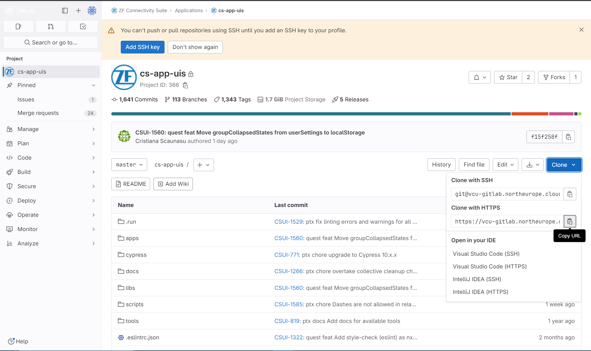
   **_figure 1.0_**

2. **Update pom.xml:** Make the necessary changes to the `**pom.xml**` files, located at the root of the **_cs-lp_** folder, within the **`cs-app-uis/apps/cs-lp`** folder. **_Refer (1.0, 1.1, 1.12 & 1.13 for details)_**
   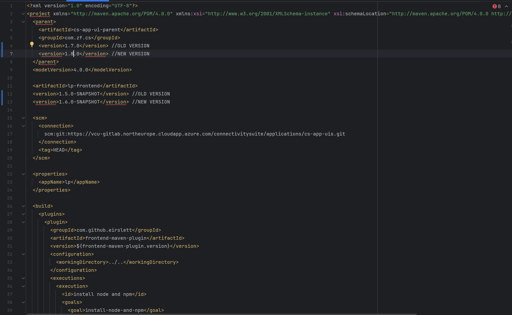
   **_figure 1.0_**
   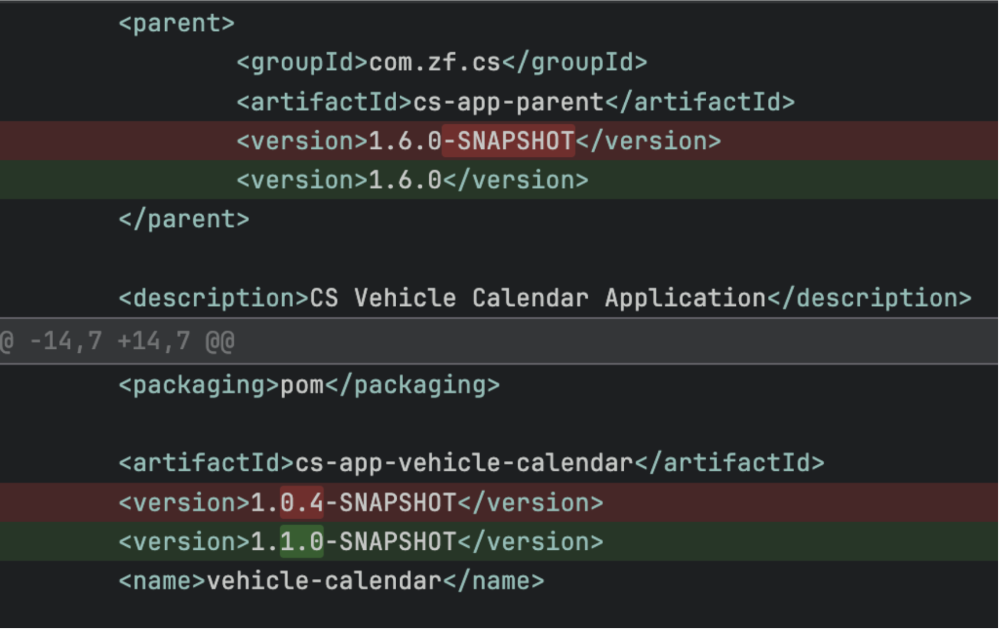
   **_figure 1.1 In pom.xml located at the root of the repository_**
   
   **_figure 1.12_**
   
   **_figure 1.13_**

3. **Create a Branch:** After the following needful changes, create a branch with the following name convention & push them on that separate branch (as we are not allowed to push directly to the master). **_Refer (1.2 & 1.3 for details)_**
   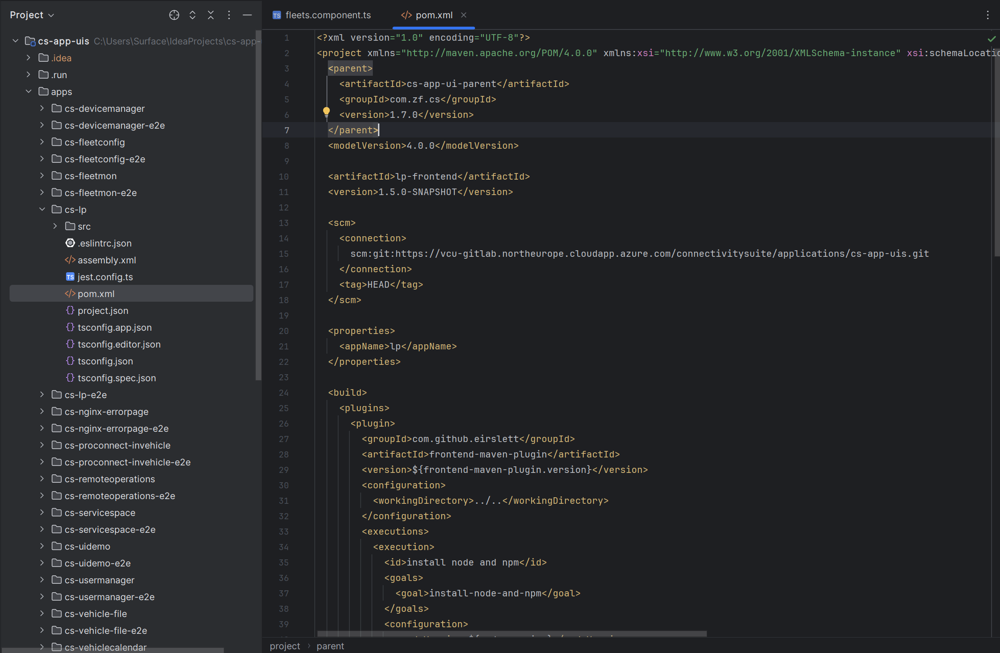
   **_figure 1.2_**
   
   **_figure 1.3_**

4. **Commit & Merge Branch:** After creating the branch, you need to push all the changes, with a brief commit message **_example_**: **_`CSLP-178:ptx Chore prepared release for APP Frontend.`_** After that you need to create a Merge Request so that an authorized member will merge your branch into the master branch (as we are not allowed to push directly to the master). **_Refer (1.4 for details)_**
   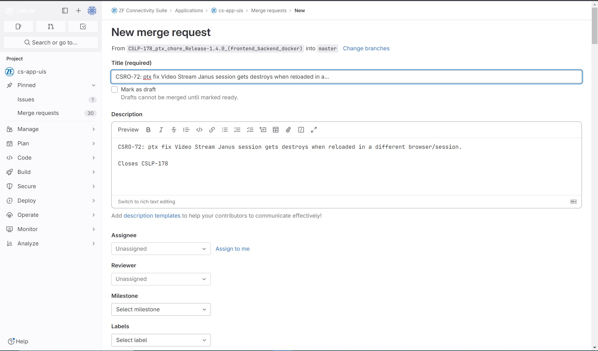
   **_figure 1.4_**

   <aside>
   ✨ **Maven** release could only be performed if the branch on which the developer did changes is merged first on the GitLab. The branches could be merged (***on GitLab***) only by the authorized members in order to move to the next step ***(i.e To Perform Maven release on Jenkins)***

   </aside>

### **Perform Maven release for the front-end on Jenkins**

1. **On Jenkins**: On Jenkins, look for the **_`Perform Maven Release`_** for the **_cs-app-landing-page-ui_**. **_Refer (1.50 & 1.51 for details)_**
2. Set the Release Version to the current version you're releasing which in this case is `***current-Release-version - 1.4.0***` and the Development version to a next SNAPSHOT VERSION which in this case would be `***Snapshot-version - 1.5.0***` (**_1.5.0- SNAPSHOT_**) and finally schedule the build. Make sure the build runs successfully
   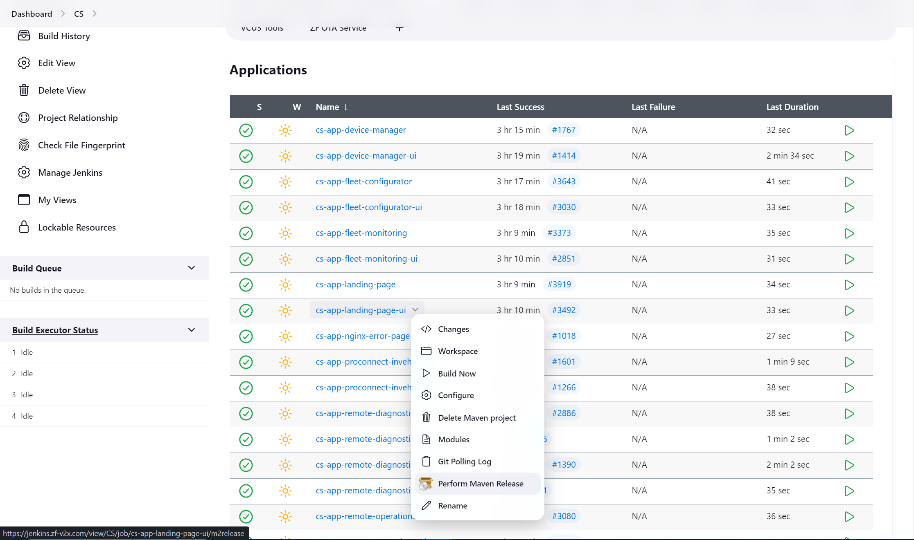
   **_figure 1.50_**
   
   **_figure 1.51_**

      <aside>
      <!-- 💡 **Remember**: Any file name <***CS-APPNAME-UI***> indicates that the file is a ***frontend application.*** -->

      </aside>

   > **_Remember:_** Suppose if we release a version is **_say 1.4.0_**, then the next **SNAPSHOT** version should be taken as **_1.5.0-SNAPSHOT_**.

## **Post Release Update** (apps-frontend)

After the Maven Release has successfully build and completed, you should **_update the project_** in your IDE to **_retrieve the changes MAVEN plugin applied_**. For that you need to go inside your IDE and look for the **_PULL_** command. **_Refer (1.60 for details)_**

**_Figure 1.60_**

## Back-End Release (apps-backend)

1. **Clone the app through the GitLab:** Check out the backend repository of the application from the search bar (eg **_cs-app-landing-page_**), and clone it from **_GitLab,_** and create a pull. **_Refer (2.0 & 2.01 for details)_**
   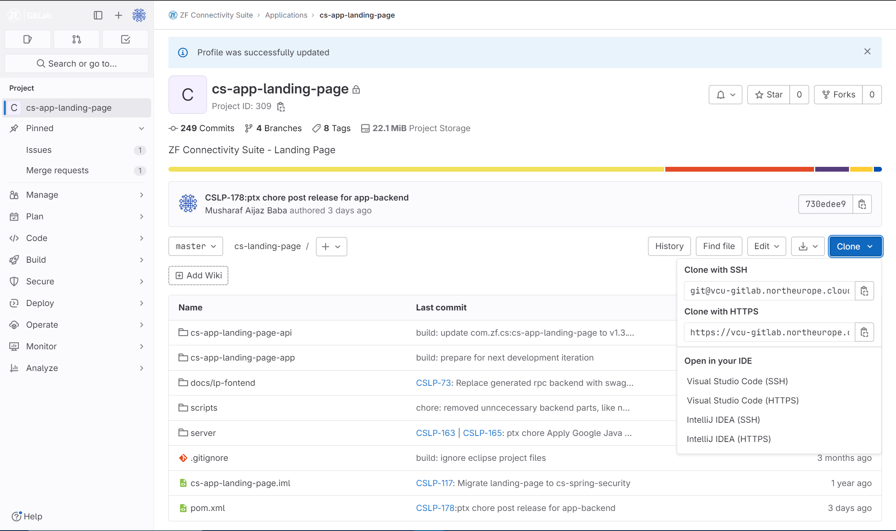
   **_Figure 2.0_**
   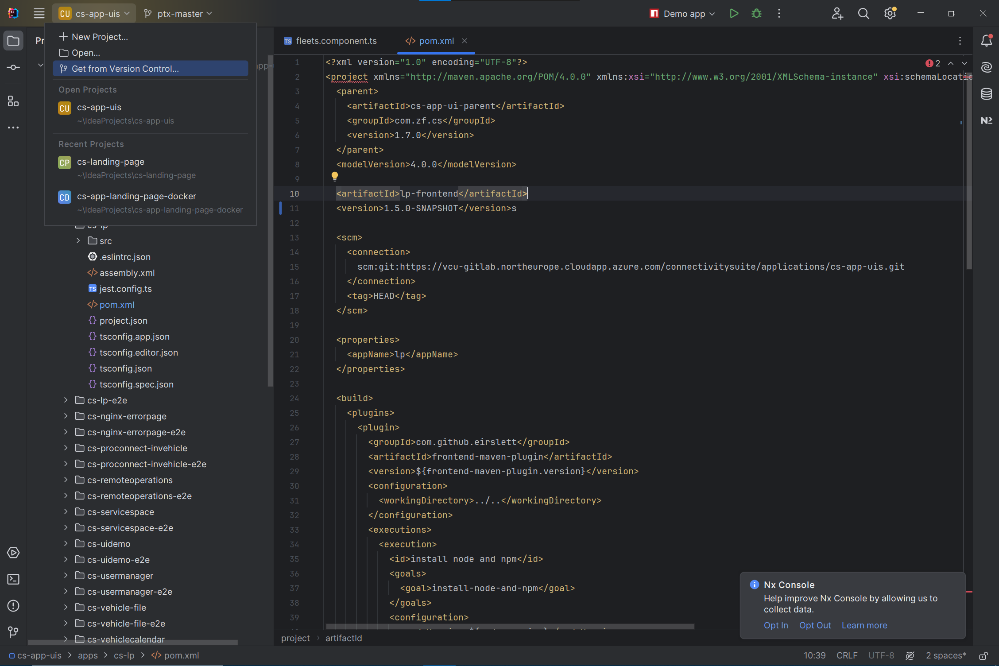
   **_Figure 2.0_** From the top menu, a small drop down will appear, click the **_Git from Version Control and paste the HTTPS/SSH clone URL to clone the repository in your IDE_**

2. **Update pom.xml:** Make the necessary changes to the `**pom.xml**` files, located at the root of the repository and within the **`apps-backend or cs-app-landing-page`** folder. **_Refer (2.10, 2.11, 2.12 & 2.13 for details)_**
   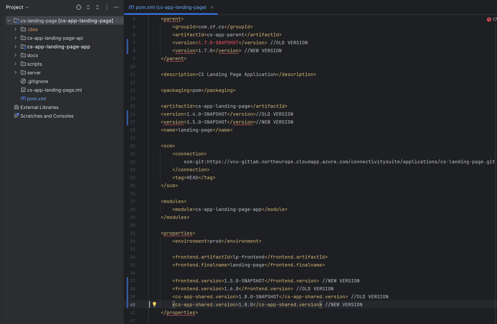
   **_Figure 2.10 - OLD VERSIONS and NEW VERSIONS are specified_**
   
   **_In pom.xml located at the root of the backend repository_**
   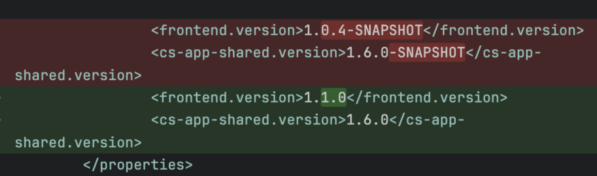
   **_In pom.xml located in the apps backend folder itself :_**
   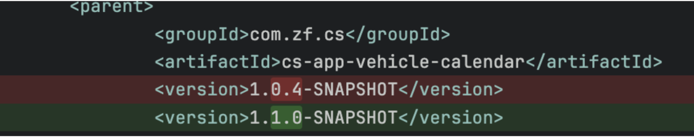
3. **Create a Branch:** After the following needful changes, create a branch with the following name convention & push them on that separate branch (as we are not allowed to push directly to the master). **_Refer (2.20 & 2.21 for details)_**
   
   **_figure 1.3_**

4. **Commit & Merge Branch:** After creating the branch, you need to push all the changes, with a brief commit message **_example_**: **_`CSLP-178:ptx Chore prepared release for APP Backend.` Remember that you will only get a prompt for Merge Request (on GitLab) if you are in the designated folder, i.e. the folder where you have performed the commit and push request._** After that you need to create a Merge Request so that an authorized member will merge your branch into the master branch (as we are not allowed to push directly to the master). **_Refer (2.3 for details)_**
   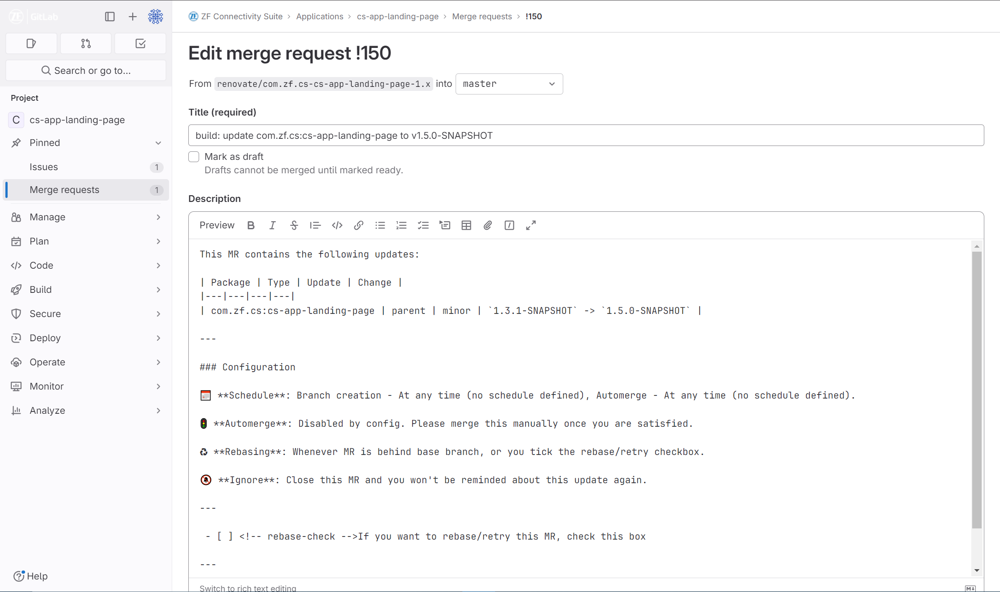
   **_Figure 2.30 shows the reference on how to make a MERGE REQUEST._**

      <aside>
   :::info Info
      ✨ **Maven** release could only be performed if the branch on which the developer did changes is merged first on the GitLab. The branches could be merged (***on GitLab***) only by the authorized members in order to move to the next step ***(i.e To Perform Maven release on Jenkins)***
      :::

      </aside>

### **Perform Maven release for the front-end on Jenkins**

1. **On Jenkins**: On Jenkins, look for the **_`Perform Maven Release`_** for the **_cs-app-landing-page_**. **_Refer (2.40 & 2.41 for details)_**
   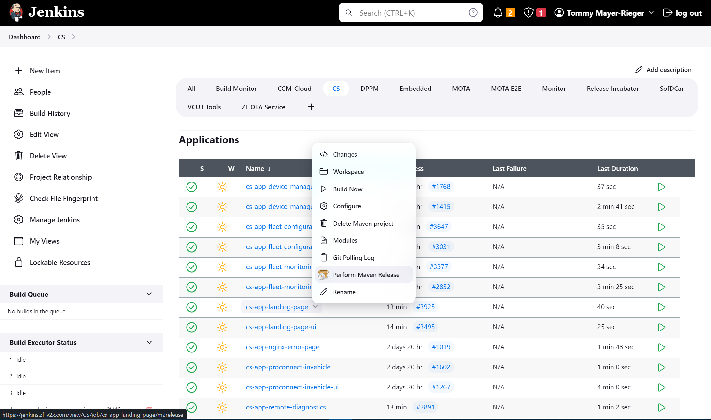
   **_Figure 2.40_**

2. Set the Release Version to the current version you're releasing which in this case is `***current-Release-version - 1.4.0***` and the Development version to a next SNAPSHOT VERSION which in this case would be `***Snapshot-version - 1.5.0***` (**_1.5.0- SNAPSHOT_**) and finally schedule the build. Make sure the build runs successfully
   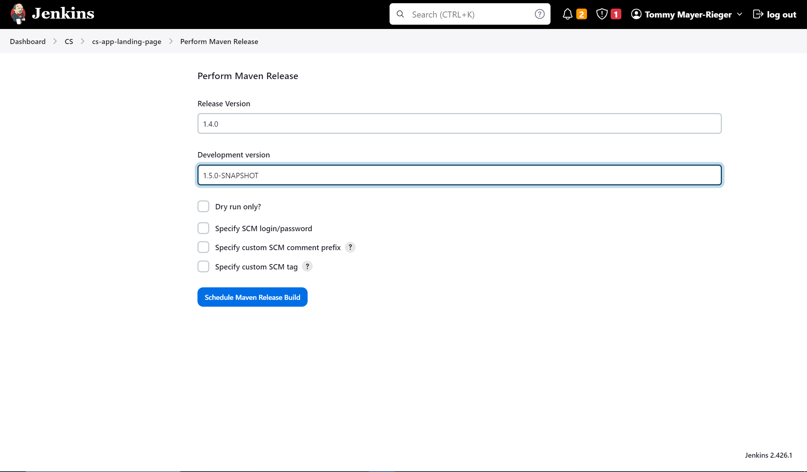
   **_Figure 2.41_**
   :::info 💡 Remember
   Any file name **< CS-APPNAME >** indicates that the file is a backend-application.
   :::
   > Suppose if we release a version is **_say 1.4.0_**, then the next **SNAPSHOT** version should be taken as **_1.5.0-SNAPSHOT_**.

## **Post Release Update** (apps-backend)

<aside>
✨ **Maven** release could only be performed if the branch on which the developer did changes is merged first on the GitLab. The branches could be merged (***on GitLab***) only by the authorized members in order to move to the next step ***(i.e To Perform Maven release)***

</aside>

1. **Pull Request from IDE:** After the Maven Release has successfully build and completed, you should **_update the project_** in your IDE to **_retrieve the changes MAVEN plugin applied_**. Pull the latest changes from the master of the backend project which **_maven plugin released._** Adjust the `**pom.xml**` located at the root of the backend repository to latest SNAPSHOT versions. **_Refer (2.50 for details)_**
   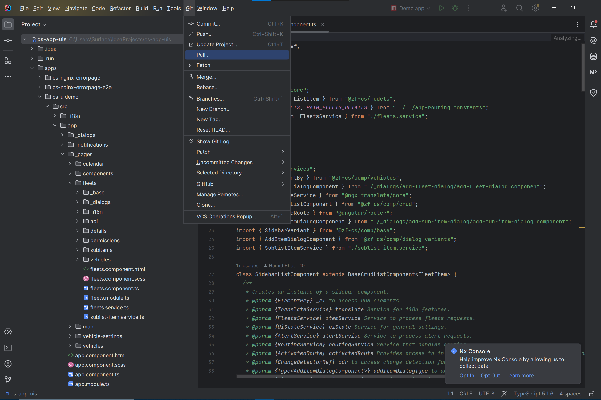
   **_Refer (2.50 for details)_**

## Docker Release (apps-docker)

1. **Clone the app through the GitLab:** Check out the docker repository of the application from the search bar (eg **_cs-app-landing-page-docker_**), and clone it from **_GitLab,_** and create a pull request. **_Refer (3.0, 3.01 & 3.02 for details)_**
   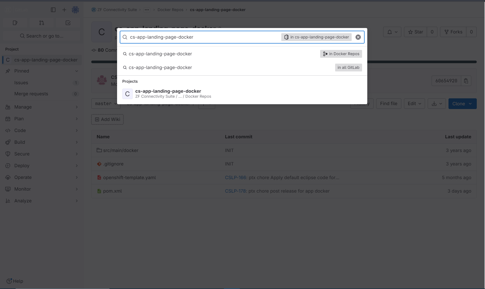
   **_Figure 3.0_**
   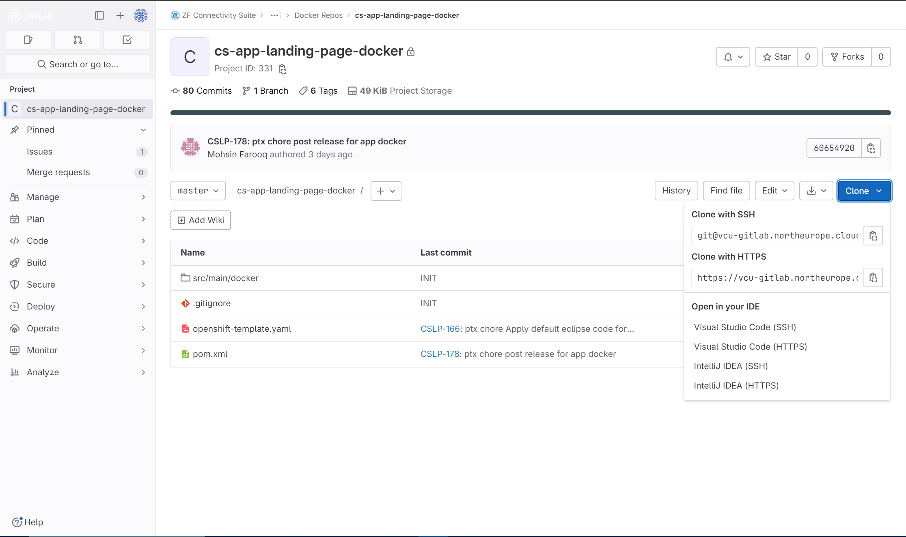
   **_Figure 3.01_**
   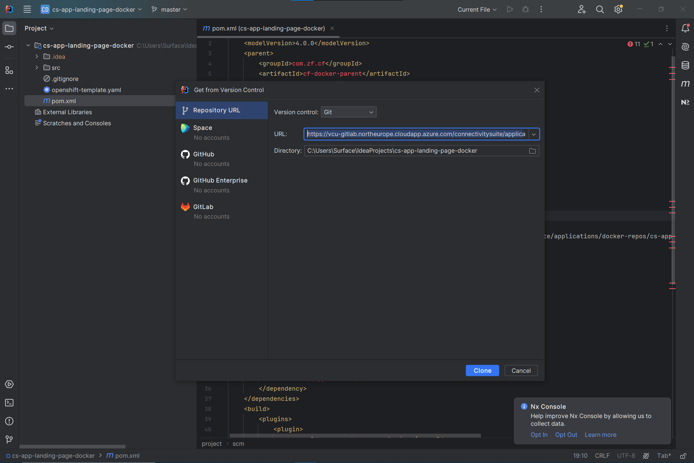
   **_Figure 3.02_**

2. **Update pom.xml:** Make the necessary changes to the `**pom.xml**` files, located at the root of the repository and within the **`apps-docker or cs-app-landing-page-docker`** folder. **_Refer (3.10 for details)_**
   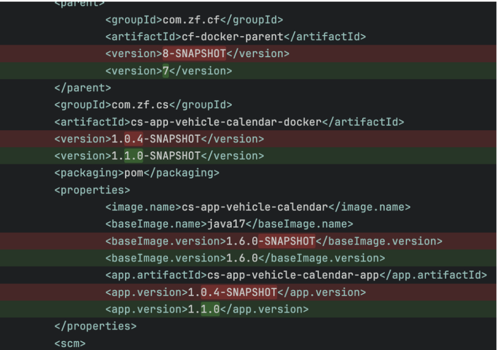
   **_Figure 3.10 in pom.xml located at the root of the app-docker repository._**

3. **Create a Branch:** After the following needful changes, create a branch with the following name convention & push them on that separate branch (as we are not allowed to push directly to the master). **_Refer (3.20 for details)_**
   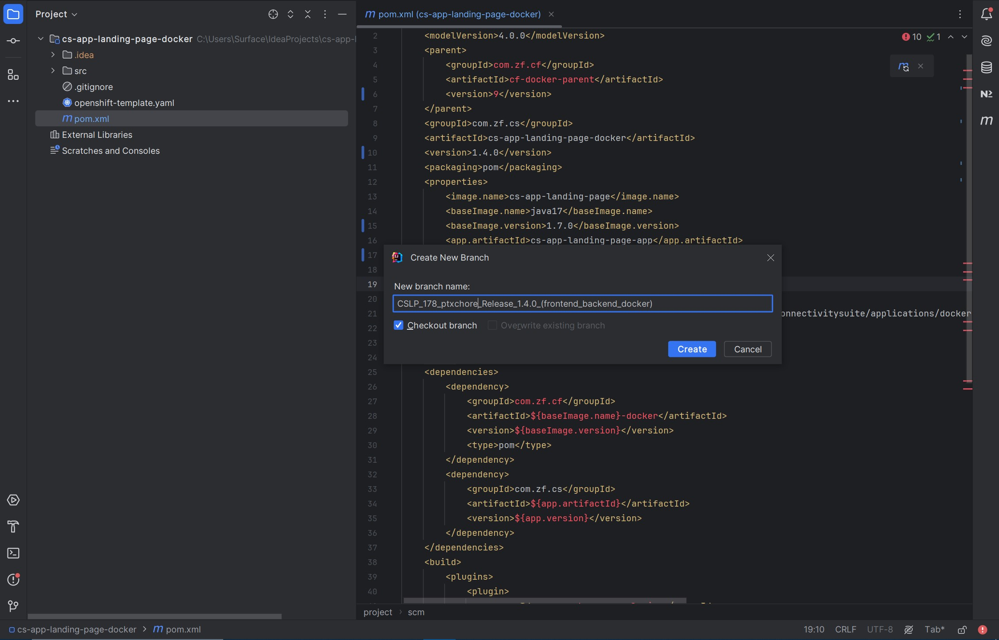
   **_Figure 3.20_**

4. **Commit & Merge Branch:** After creating the branch, you need to push all the changes, with a brief commit message **_example_**: **_`CSLP-178:ptx Chore prepared release for APP Docker.` Remember that you will only get a prompt for Merge Request (on GitLab) if you are in the designated folder, i.e. the folder where you have performed the commit and push request._** After that you need to create a Merge Request so that an authorized member will merge your branch into the master branch (as we are not allowed to push directly to the master). **_Refer (3.30 for details)_**
   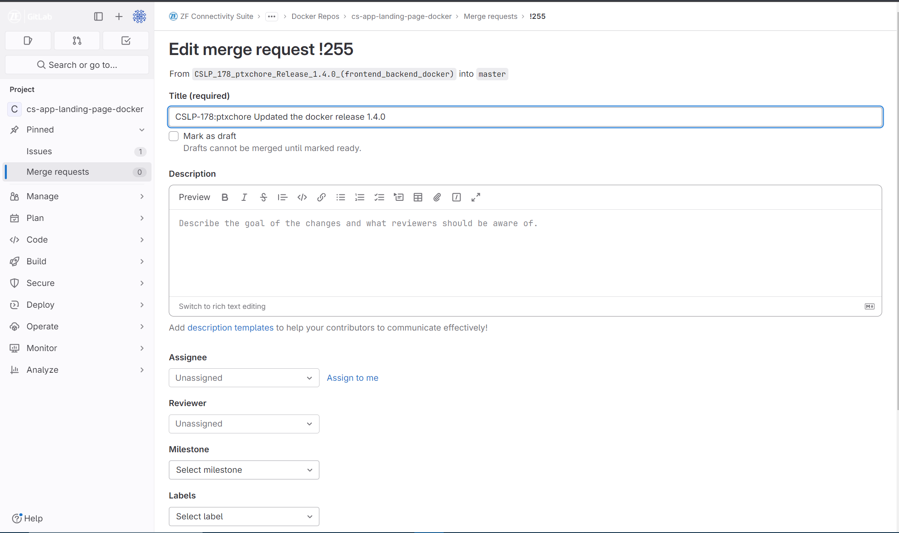
   **_Figure 3.30_**

:::info Tip
✨ **Maven** release could only be performed if the branch on which the developer did changes is merged first on the GitLab. The branches could be merged (**_on GitLab_**) only by the authorized members in order to move to the next step **_(i.e To Perform Maven release on Jenkins)_**
:::

### Perform Maven release for the app-docker project

1. **On Jenkins**: On Jenkins, look for the **_`Perform Maven Release`_** for the **_cs-app-landing-page-docker (In the container section)_**. **_Refer (3.40 for details)_**
   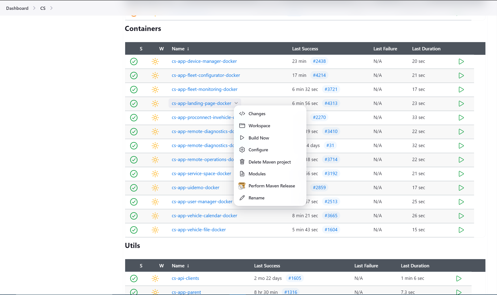
   **_Figure 3.40_**

2. Set the Release Version to the current version you're releasing which in this case is `***current-Release-version - 1.4.0***` and the Development version to a next SNAPSHOT VERSION which in this case would be `***Snapshot-version - 1.5.0***` (**_1.5.0- SNAPSHOT_**) and finally schedule the build. Make sure the build runs successfully.
   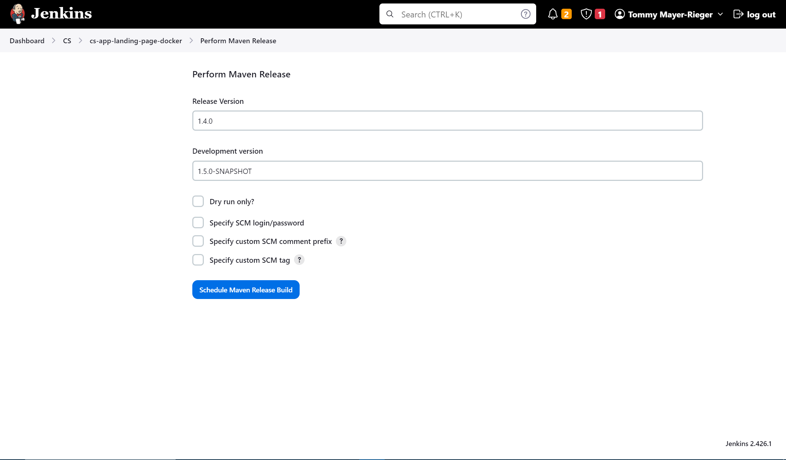
   :::warning Info
   💡 **Remember**: Any file name < **_CS-APPNAME-DOCKER_** > indicates that the file is a **_docker application._**

   :::

> **_Remember:_** Suppose if we release a version is **_say 1.4.0_**, then the next **SNAPSHOT** version should be taken as **_1.5.0-SNAPSHOT_**.

## **Post Release Update** (apps-docker)

:::info Tip
merged first on the GitLab. The branches could be merged (**_on GitLab_**) only by the authorized members in order to move to the next step **_(i.e To Perform Maven release)_**
:::

1. **Pull Request from IDE:** Pull the latest changes from the master for the docker project that maven plugin release. Adjust the `**pom.xml**` located at the root of the docker repository to latest SNAPSHOT versions. Refer the Code snippets below. **_Refer (4.00 for details)_**
   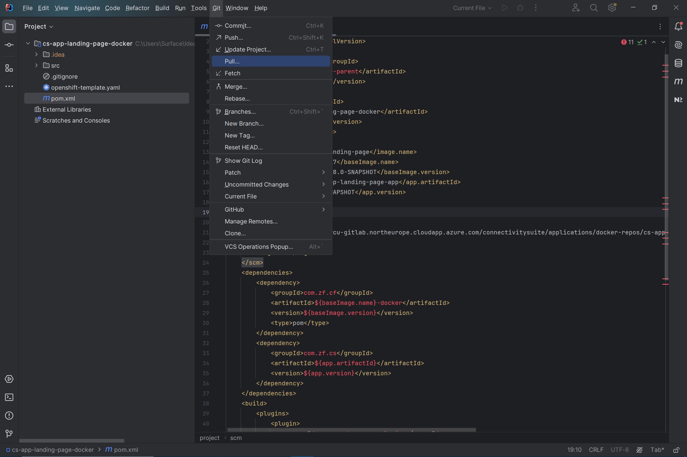
   **_Figure 4.00_**

2. **Commit and Push:** Commit the changes with a message like : **_CSLP-178: ptx chore post release 1.1.0_** and **_push_** the changes onto a branch which would later be merged by the authorized member.

:::warning
💡 **Important Notice: _Once the app-release is done for all these platforms, we need to inform this in the <span style={{color: "#99ccff"}}>#cs-app-release</span> and <span style={{color: "#99ccff"}}>#shared-components-topic channel</span> ,_** to inform other team member about the release and keep them updated.
:::

## Trouble Shoot: Important Points to Ponder

1. Some times **_Maven Release is unsuccessful,_** its because the **\*\***branches you pushed to the **_GitLab_** were not merged by the authorized members in order to move to the next step, and hence Jenkins shows such error message **_`BUILD FAILURE.` The build failure error may looks like:_**

   ```
   C:\Users\Babar>mvn archetype:generate -DgroupId=com.mycompany.app -DartifactId=m
   y-app -DarchetypeArtifactId=maven-archetype-quickstart -DinteractiveMode=false
   [INFO] Scanning for projects...
   [INFO]
   [INFO] ------------------------------------------------------------------------
   [INFO] Building Maven Stub Project (No POM) 1
   [INFO] ------------------------------------------------------------------------
   [INFO]
   [INFO] >>> maven-archetype-plugin:2.1:generate (default-cli) @ standalone-pom >>
   >
   [INFO]
   [INFO] <<< maven-archetype-plugin:2.1:generate (default-cli) @ standalone-pom <<
   <
   [INFO]
   [INFO] --- maven-archetype-plugin:2.1:generate (default-cli) @ standalone-pom --
   -
   [INFO] Generating project in Batch mode
   [INFO] -------------------------------------------------------------------------
   ---
   [INFO] Using following parameters for creating project from Old (1.x) Archetype:
    maven-archetype-quickstart:1.0
   [INFO] -------------------------------------------------------------------------
   ---
   [INFO] Parameter: groupId, Value: com.mycompany.app
   [INFO] Parameter: packageName, Value: com.mycompany.app
   [INFO] Parameter: package, Value: com.mycompany.app
   [INFO] Parameter: artifactId, Value: my-app
   [INFO] Parameter: basedir, Value: C:\Users\Babar
   [INFO] Parameter: version, Value: 1.0-SNAPSHOT
   [INFO] ------------------------------------------------------------------------
   [INFO] BUILD FAILURE
   [INFO] ------------------------------------------------------------------------
   [INFO] Total time: 22.971s
   [INFO] Finished at: Fri Nov 18 00:07:12 EET 2011
   [INFO] Final Memory: 6M/11M
   [INFO] ------------------------------------------------------------------------
   [ERROR] Failed to execute goal org.apache.maven.plugins:maven-archetype-plugin:2
   .1:generate (default-cli) on project standalone-pom: Directory my-app already ex
   ists - please run from a clean directory -> [Help 1]
   [ERROR]
   [ERROR] To see the full stack trace of the errors, re-run Maven with the -e swit
   ch.
   [ERROR] Re-run Maven using the -X switch to enable full debug logging.
   [ERROR]
   [ERROR] For more information about the errors and possible solutions, please rea
   d the following articles:
   [ERROR] [Help 1] http://cwiki.apache.org/confluence/display/MAVEN/MojoFailureExc
   eption
   'cmd' is not recognized as an internal or external command,
   operable program or batch file.
   ```

   :::info Info
   💡 You Just need to **_wait_**, or **_simply ask_** the authorized members to approve these **_merge requests_**.
   :::

2. Even after mergers are properly approved, errors can still occur in Jenkins. This is because the app version on **_`ZF confluence`_** might not be updated to the latest version. To resolve this, you can either ask a senior team member to update the app or, if you have access you can edit the version there, and then repeat the process on the latest version of the Jenkins.

:::info NOTE
💡 **_In ZF confluence, you can see the updated versions and information of other apps as well._**
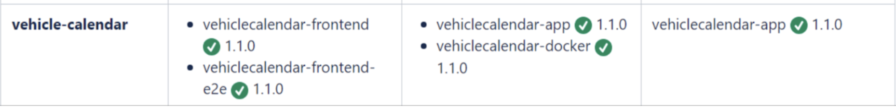
:::
