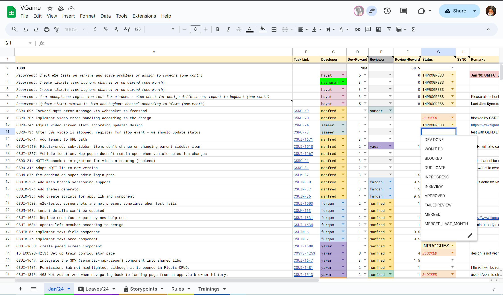
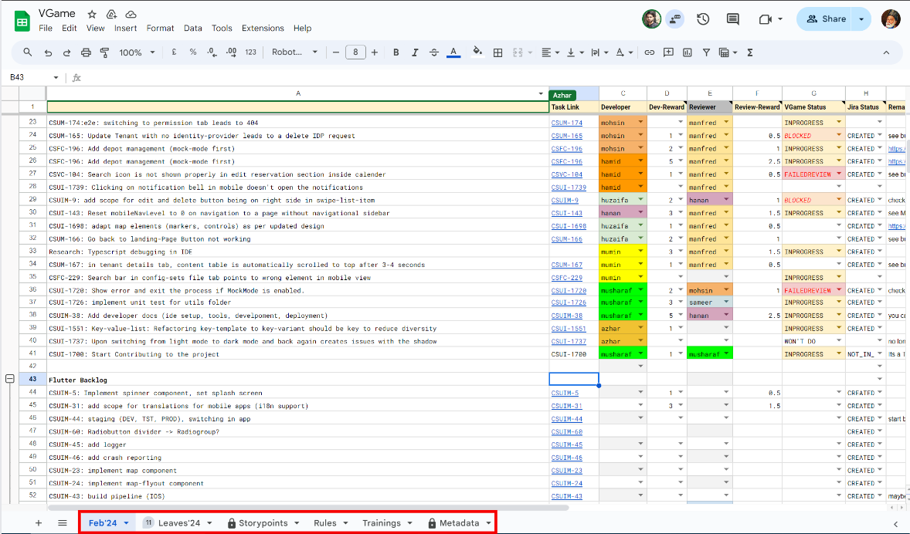
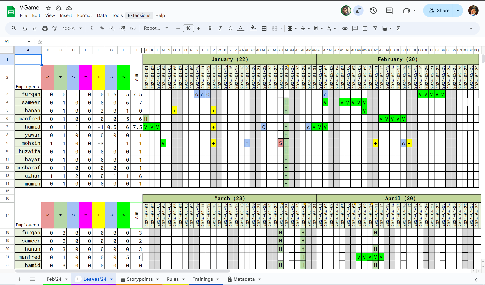
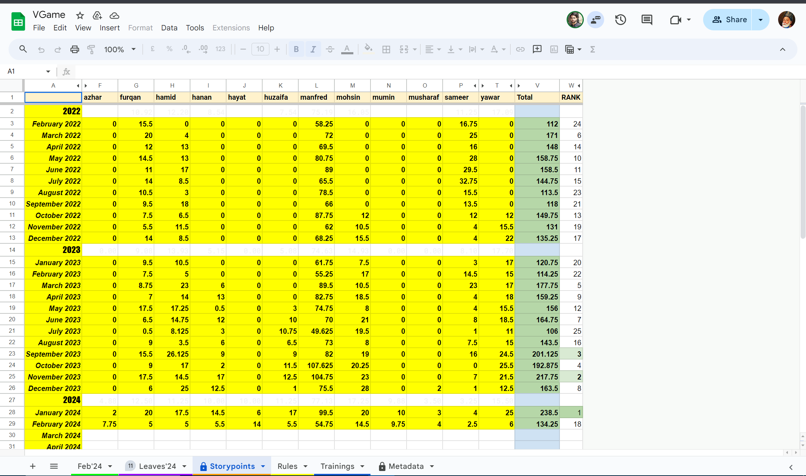

# Understanding VGame

:::info 📒 **Prerequisites**
Before continuing with this section, we need the access of the [\*\*\*VGame](https://docs.google.com/spreadsheets/d/1xOr_1iu4FXiPPFKI1PSKWIkDAIZmBtdYRSq97Z3RGAY/edit?pli=1#gid=468045289)
:::

> 💡 **All necessary contribution information is available within VGame.**

:::info
The VGame is a special Excel document that is meant for the developers of the team. The VGame contains all the necessary Information for a developer to start developing and contributing to the project.
:::

## Important VGame Sheets:

1. Feb’24
2. Leaves
3. Story Points
4. Rules
5. Trainings
6. Metadata

<!--  -->

- The Feb’24 sheets represents the current month of working. All the ToDo Tasks, Task Links, Reward points, task links etc are there.
- **Leaves Sheet**: It is simply an attendance register which marks your Vacations, Overtime, etc. where:
  V → Vacations
  H→ Holiday
    <!--  -->
  
- **Story Points**: These are ways to estimate how much efforts it takes to complete a task for a developer. We use the Fibonacci sequence (0.125, 0.5, 1, 2, 3, 5, 8, etc.) for story point estimations. On completing a task, the developer gets some rewards according to the story points of the task. `**On completing a task, the developer gets rewards accroding to the story points associated with the task.**`
    <!--  -->
  

## Understand the Task Sheet

<aside>
:::info 💡INFO
 The ***VGame*** Monthly Task Sheet contains information like ***Ticket Name*** & ID, ***Task Link***, ***Assigned Developer***, ***Dev rewards***, ***Reviewer***, ***Status*** and ***Remarks***. All these will be elaborated in a brief below.
 :::

</aside>

1. **Ticket Name & ID:** This is the first column and contains information about the Ticket name and ID. This is very important in terms of contribution, because gives you an Information regarding your task and while contributing you need to create a branch first, in your IntelliJ IDE, with the specified ticket name and ID, before it gets merged to the master branch.
2. **Task Link:** This is the second column of the VGame and you need to copy this link and paste it in the Citrix browser. There in you will be able to access the task and can check the required information like Tasks Description, Relevant Screen Shots, Developer assigned etc.
3. **Assigned Developer**: This is the third section and Mentions the Developer assigned for the task. Once you will get the access to Jira, you will be even able to check the assigned tasks to you there.
4. **Dev Rewards:** These are the story points given to a developer according to the work and efforts to complete the assigned task.
5. **Reviewer**: This is the 5th column and this column mentions the assignee of the task. The reviewer too gets half of the dev rewards. The reviewer is the one who checks your contributions and and Merges them. If there’s any issue with your code, then the reviewer marks it, and then informs you accordingly.
6. **Status**: This column talks about the status of the task. That means if the task is still in progress you need to mark **_IN-PROGRESS_**. If the task is completed you can mark **_DEV DONE,_** and etc.

   <!--  -->

   

   **_Refer to the screen shot for other tags._**
